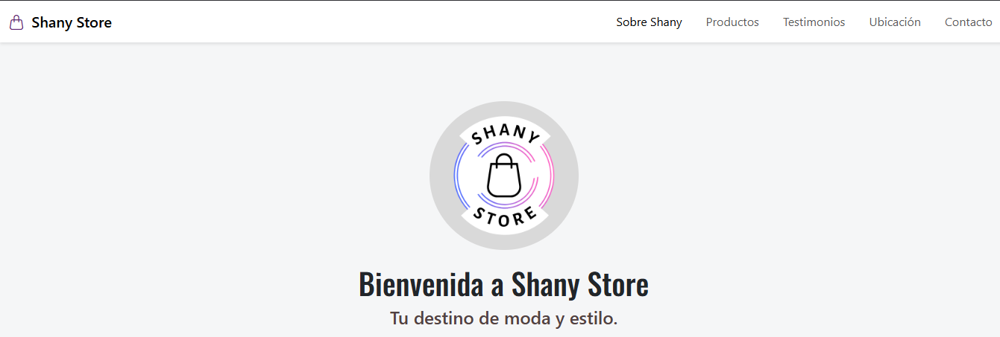

# 🛍️ Shany Store: Tu Destino de Moda y Estilo 💖

---

## 📝 Descripción del Proyecto

**Shany Store** es una página web moderna y completamente responsiva, diseñada como un escaparate virtual para una tienda de moda. Este proyecto ha sido construido con las últimas tecnologías web, ofreciendo una experiencia de usuario atractiva e intuitiva, destacando la variedad de productos, testimonios de clientes y facilidades de contacto.

El objetivo principal es presentar una tienda de ropa y accesorios en línea de manera profesional y accesible desde cualquier dispositivo, mostrando un catálogo de productos organizado, una sección de testimonios para generar confianza y una clara invitación a la interacción.

---

## ✨ Características Destacadas

- **Diseño Responsivo:** Adaptado para lucir impecable en computadoras de escritorio, tablets y dispositivos móviles, gracias al uso de Bootstrap y media queries personalizadas.
- **Navegación Intuitiva:** Barra de navegación fija con enlaces de anclaje para una experiencia de usuario fluida y rápida.
- **Sección Hero Atractiva:** Con un diseño moderno que capta la atención del visitante de inmediato.
- **Catálogo de Productos Dinámico:** Presentación de productos en un formato de tarjetas responsivo con detalles y descripciones.
- **Testimonios en Carrusel:** Un carrusel interactivo que muestra la satisfacción de los clientes, construido con componentes de Bootstrap.
- **Ubicación Integrada:** Mapa interactivo de Google Maps para facilitar la localización de la tienda física.
- **Sección de Contacto Eficaz:** Con un llamado a la acción claro para que los usuarios puedan resolver sus dudas.
- **Pie de Página Completo:** Incluye logo, texto informativo y enlaces a redes sociales para fortalecer la presencia en línea.

---

## 🛠️ Tecnologías Utilizadas

- **HTML5**: Para la estructura semántica y el contenido principal de la página.
- **CSS3**: Para la estilización personalizada, efectos visuales y ajustes finos del diseño.
- **Bootstrap 5**: Framework CSS de vanguardia para el diseño responsivo, componentes de interfaz de usuario (barra de navegación, tarjetas, carrusel, sistema de cuadrícula) y utilidades.
- **Google Fonts**: Para una tipografía moderna y atractiva (`Oswald`, `Quicksand`, `Share Tech Mono`).
- **Bootstrap Icons**: Para íconos vectoriales modernos y ligeros que complementan el diseño.

---

## 📦 Cómo Usarlo

Para explorar el proyecto en tu máquina local, sigue estos pasos:

1.  **Clona el repositorio:**
    ```bash
    git clone https://github.com/josecervera20/shany-store.git
    ```
2.  **Navega al directorio del proyecto:**
    ```bash
    cd shany-store
    ```
3.  **Abre el archivo `index.html`** en tu navegador web preferido para ver la página en acción.

---

## 🎨 Captura de Pantalla



---

## 🤝 Contribuciones

¡Las contribuciones son siempre bienvenidas! Si tienes ideas para mejorar este proyecto, o encuentras algún problema, no dudes en:

1.  Hacer un `fork` del repositorio.
2.  Crear una nueva rama (`git checkout -b feature/tu-mejora`).
3.  Enviar un `pull request` con una descripción detallada de tus cambios.

---

## 📄 Licencia

Este proyecto es de código abierto y se publica bajo la [Licencia MIT](LICENSE). Siéntete libre de usar, modificar y distribuir este código para tus propios proyectos.

---
